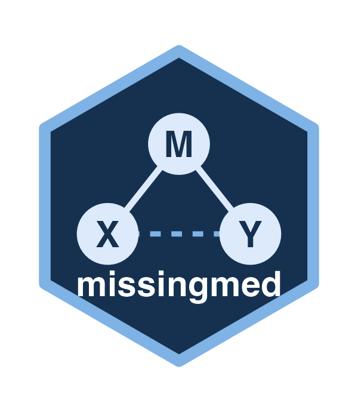

# missingmed <a href="https://data-wise.github.io/missingmed/"></a>

<!-- badges: start -->
[](https://github.com/Data-Wise/missingmed/actions/workflows/check.yml)
[](https://data-wise.r-universe.dev/missingmed)
[](https://lifecycle.r-lib.org/articles/stages.html#experimental)
[](https://www.gnu.org/licenses/old-licenses/gpl-2.0.html)
<!-- badges: end -->

## Overview

**missingmed** runs SEM/GLM-based mediation analysis across incomplete data and
pools with Rubin's rules. It is the *missing-data middle* of the
[mediationverse](https://github.com/Data-Wise/mediationverse): a thin
orchestration layer that **fits** each analysis with
[medfit](https://data-wise.github.io/medfit/) and delegates **inference** to
[RMediation](https://data-wise.github.io/rmediation/).

Two estimators share one S7 pipeline:

* **Multiple imputation** (`method = "mi"`) — pools per-imputation fits with
  Rubin's rules.
* **Inverse-probability weighting** (`method = "ipw"`) — reweights complete cases
  (stabilized weights, trimming, HC sandwich SEs).

For the indirect effect it provides both a **Monte-Carlo confidence interval**
and a **D4-stacked MBCO** likelihood-ratio test (which, unlike pooling, respects
the union-null geometry of `H0: ab = 0`).

## Installation

From the Data-Wise R-universe (binaries, no compilation):

```r
install.packages(
  "missingmed",
  repos = c("https://data-wise.r-universe.dev", "https://cloud.r-project.org")
)
```

Or the development version from GitHub (also pulls the non-CRAN deps):

```r
# install.packages("pak")
pak::pak("Data-Wise/missingmed")
```

## The pipeline

```
set_md_mediation()  ->  run()          ->  pool()             ->  infer()
   MDMediationData       MDMediationFit     MDMediationResult      CI / MBCO
```

```r
library(missingmed)

# `imp` is a mice::mids object; X -> M -> Y with confounder C
md  <- set_md_mediation(imp, Y ~ X + M + C, M ~ X + C,
                        treatment = "X", mediator = "M")  # method = "mi" (default)
res <- pool(run(md))

infer(res, type = "mc")    # Monte-Carlo CI for the indirect effect
infer(run(md), type = "mbco")  # D4-stacked MBCO test of H0: ab = 0
```

Inverse-probability weighting takes a raw `data.frame`:

```r
md_ipw <- set_md_mediation(df, Y ~ X + M + C, M ~ X + C,
                           treatment = "X", mediator = "M", method = "ipw")
infer(pool(run(md_ipw)), type = "mc")
```

See `vignette("missingmed")` to get started, `vignette("mbco-mi")` for why MBCO
needs the per-imputation fits, and `vignette("technical")` for the full design,
contracts, and methodology.

## Ecosystem

`missingmed` → {`medfit` (fitting), `RMediation` (inference)}; simulation via
`medsim`. All are part of the [mediationverse](https://github.com/Data-Wise/mediationverse).

## Citation

```
Tofighi, D. (2026). missingmed: Mediation Analysis with Multiple Imputation
for Missing Data. R package version 0.3.1.
https://github.com/Data-Wise/missingmed
```

## License

GPL-2 · Davood Tofighi (dtofighi@gmail.com) · ORCID 0000-0001-8523-7776
