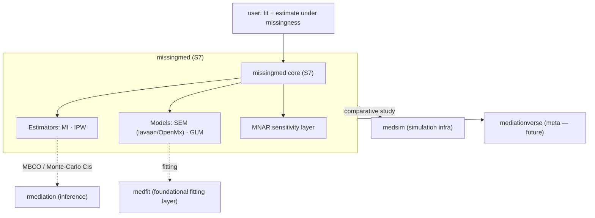

# SPEC: missingmed package scope

| | |
|---|---|
| **Status** | draft |
| **Created** | 2026-06-04 |
| **From brainstorm** | deep brainstorm (8 questions), 2026-06-04 |
| **Resolves** | Data-Wise/missingmed#1 (Decision 1: scope; informs Decision 2: S4→S7) |
| **Companion manuscript** | `~/projects/research/Missing Effect/` (Data-Wise/missing-effect) |

## Overview

`missingmed` will become a **general, CRAN-targeted R package for missing-data causal mediation**. It provides multiple **estimators** (multiple imputation and IPW) across **SEM and GLM** mediation models, under **MAR with MNAR sensitivity analysis**. It is built on **S7** (migrated from the current S4) and is *ecosystem-native*: it delegates **inference** (MBCO / Monte-Carlo CIs) to `rmediation` and the **comparative simulation study** to `medsim`, rather than re-implementing them.

This resolves the scope question in `missingmed#1`: **full comparative toolkit**, not MI-only.

## Primary user story

> As a **methodologist / applied researcher** analyzing mediation with incomplete data, I want a single package that lets me estimate natural direct/indirect effects under missingness via **either MI or IPW**, for **SEM or GLM** models, with **valid inference** and an honest **MNAR sensitivity** check — so I can both run real analyses and reproduce the manuscript's method comparison without stitching together several tools.

## Acceptance criteria

- [ ] S7 class system replaces S4, mirroring the current MI pipeline, with no loss of existing functionality.
- [ ] MI estimator works for **SEM (lavaan/OpenMx)** and **GLM** outcome/mediator models.
- [ ] **IPW** estimator available with the same model/inference plumbing as MI.
- [ ] MBCO / Monte-Carlo-CI inference is obtained by **calling `rmediation`** (not re-implemented).
- [ ] **MNAR sensitivity** analysis available for departures from MAR.
- [ ] The manuscript's comparison study runs through **`medsim`**.
- [ ] CRAN-ready: vignettes, tests, clean `R CMD check`, revdep, `DESCRIPTION` reflects final scope.

## Secondary user stories

> As a **mediationverse maintainer**, I want missingmed on S7 so it can be wired into the `mediationverse` meta-package alongside `medfit`/`probmed`/`medrobust`.

> As a **reproducibility-minded reviewer**, I want the simulation study to live in `medsim` so the MI-vs-IPW-vs-MBCO comparison is re-runnable from a standard harness.

## Architecture

**Boundaries (what missingmed does NOT own):** MBCO/MC-CI inference → `rmediation`; simulation harness → `medsim`; (candidate) low-level model fitting → `medfit`.

## API design

Indicative S7 surface (to be refined during Phase 0/1):

| Generic / function | Purpose |
|---|---|
| `set_md_mediation(data, model, method=)` | Construct the analysis object; `method ∈ {"mi","ipw"}` |
| `run()` | Estimate across imputations (MI) or weighted sample (IPW) |
| `pool()` | Pool MI results (Rubin's rules) → estimates + variance |
| `infer(..., type=c("mbco","mc"))` | Effect CIs — **delegates to `rmediation`** |
| `sensitivity_mnar(...)` | MNAR departure sensitivity analysis |
| `print()/summary()/tidy()` | S7 output methods |

S7 classes (migrated from S4 `SemImputedData`/`SemResults`/`PooledSEMResults`): `MDMediationData` → `MDMediationFit` → `MDMediationResult` (names TBD).

## Data models

S7 classes carry: imputed/weighted data, model spec (SEM syntax or GLM formulas), per-replicate fits, pooled estimates, the missing-data mechanism assumption, and a link to the inference backend. Detailed property lists deferred to Phase 0 design.

## Dependencies

- **Imports (planned):** `S7`, `mice` (MI), **`medfit`** (fitting + `MediationData`, confirmed), **`rmediation`** (MBCO/MC-CI inference, confirmed — promote from Suggests), `lavaan`/`OpenMx` (SEM fits feeding `extract_mediation()`).
- **Suggests (planned):** `medsim` (simulation study), `testthat`, `knitr`/`quarto`.
- **Note:** `rmediation` already `Imports: medfit`, so the three packages share the S7 `MediationData` contract.

## UI/UX specifications

N/A — programmatic R package (no GUI). Developer experience = clean S7 generics, informative `print`/`summary`, and vignettes per estimator.

## Resolved contracts (investigated 2026-06-04)

**Q1 — rmediation inference: RESOLVED, no extension needed.** `rmediation` (v1.4.0, S7) exports `mbco()`, `medci()` (types `dop`/`mc`/`asymp`/`prodclin`), **`ci_mediation_data()`**, `ci_serial_mediation_data()`, `pMC`/`qMC`. `rmediation/R/ci_medfit.R` already consumes a `medfit` `MediationData` (`@estimates`/`@vcov`) and `rmediation` already `Imports: medfit`. → missingmed delegates inference by handing a (pooled) MediationData to `ci_mediation_data()`/`medci()`.
- **Contract:** rmediation requires **named** `@estimates`/`@vcov` (no positional matching). missingmed's pooled object MUST carry named path parameters.

**Q2 — medfit fitting: RESOLVED, build on it.** `medfit` (v0.2.0, S7) `fit_mediation(formula_y, formula_m, engine="glm", family_y, family_m)` returns S7 `MediationData` (all GLM families → the GLM half); `extract_mediation()` + `extract-lavaan.R` cover the SEM half. `MediationData@estimates`/`@vcov` are exactly the inputs Rubin's-rules pooling needs. Effect generics (`nde`/`nie`/`te`/`pm`/`decompose`) and `bootstrap_mediation` are reusable.

**Net effect on scope:** fitting (`medfit`) and inference (`rmediation`) are both reused. missingmed's **unique code** is the missingness middle: per-replicate orchestration, **Rubin's-rules pooling of (estimates, vcov) → a named pooled MediationData**, IPW weight construction, and the MNAR sensitivity layer. This substantially de-risks the "full toolkit" roadmap.

## Open questions (remaining)

1. **MNAR sensitivity** — how much can reuse patterns/scaffolding from `medrobust` (different problem — misclassification vs. missingness — but related sensitivity machinery)?
2. **Estimand consistency** — ensure NDE/NIE definitions match across MI, IPW, and `rmediation`-backed inference (and align with `medfit`'s `nde`/`nie`).
3. **Pooling object** — confirm `medfit::MediationData` can be reconstructed from pooled estimates/vcov (i.e. a constructor accepting named estimates + vcov) so the pooled result is a valid input to `rmediation`.
4. **Scope vs. timeline** — gate Phases 1–2 to the manuscript; Phases 3–5 (MNAR, full study, CRAN) post-publication?

## Review checklist

- [ ] Scope (full toolkit) confirmed and written into `DESCRIPTION`/README
- [ ] S7-first sequencing agreed (Phase 0 before new estimators)
- [ ] `rmediation` MBCO contract confirmed (Open Q1)
- [ ] `medfit` fitting decision made (Open Q2)
- [ ] `missingmed#1` updated/closed with these decisions
- [ ] Phasing reviewed against manuscript timeline

## Implementation notes

- **missingmed is a thin orchestration layer**, not a from-scratch estimator suite: fit via `medfit`, infer via `rmediation`, simulate via `medsim`. Its own code = per-replicate loop + **Rubin's-rules pooling of (named estimates, vcov)** + IPW weights + MNAR sensitivity.
- **Phase 0 (S7 migration) is the critical path** *and the integration key* — S7 is what lets missingmed accept `medfit::MediationData` and feed `rmediation`. Do it before adding IPW/GLM so new code isn't written twice in S4.
- **Named-parameter contract:** the pooled `MediationData` must carry **named** `@estimates`/`@vcov` — `rmediation` resolves paths by name and errors otherwise.
- Keep estimators (MI/IPW) and models (SEM/GLM) as **orthogonal axes** in the S7 design so combinations compose cleanly.
- Treat `medfit`, `rmediation`, `medsim` as **versioned contracts**, not internal code — pin and test against them.
- Tie Phases 1–2 to the manuscript's needs; Phases 3–5 (MNAR, full study, CRAN) can run post-submission.

## History

- **2026-06-04** — Created from deep brainstorm. Decisions: full comparative toolkit; implement IPW; MBCO→`rmediation`; sims→`medsim`; SEM+GLM; +MNAR sensitivity; **S7 migration first**; positioning = general CRAN toolkit.
- **2026-06-04** — Contract investigation: confirmed `rmediation` (MBCO/MC-CI, S7, already `Imports: medfit`, consumes `MediationData`) and `medfit` (`fit_mediation`/`extract_mediation` → `MediationData@estimates/@vcov`). Reframed missingmed as a thin S7 orchestration+pooling layer between them. Open Qs 1–2 resolved; surfaced the named-`@estimates`/`@vcov` contract.
