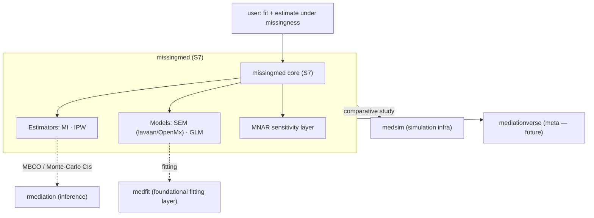

# SPEC: missingmed package scope

| | |
|---|---|
| **Status** | draft |
| **Created** | 2026-06-04 |
| **From brainstorm** | deep brainstorm (8 questions), 2026-06-04 |
| **Resolves** | Data-Wise/missingmed#1 (Decision 1: scope; informs Decision 2: S4→S7) |
| **Companion manuscript** | `~/projects/research/Missing Effect/` (Data-Wise/missing-effect) |

## Overview

`missingmed` will become a **general, CRAN-targeted R package for missing-data causal mediation**. It provides multiple **estimators** (multiple imputation and IPW) across **SEM and GLM** mediation models, under **MAR with MNAR sensitivity analysis**. It is built on **S7** (migrated from the current S4) and is *ecosystem-native*: it delegates **inference** (MBCO / Monte-Carlo CIs) to `rmediation` and the **comparative simulation study** to `medsim`, rather than re-implementing them.

This resolves the scope question in `missingmed#1`: **full comparative toolkit**, not MI-only.

## Primary user story

> As a **methodologist / applied researcher** analyzing mediation with incomplete data, I want a single package that lets me estimate natural direct/indirect effects under missingness via **either MI or IPW**, for **SEM or GLM** models, with **valid inference** and an honest **MNAR sensitivity** check — so I can both run real analyses and reproduce the manuscript's method comparison without stitching together several tools.

## Acceptance criteria

- [ ] S7 class system replaces S4, mirroring the current MI pipeline, with no loss of existing functionality.
- [ ] MI estimator works for **SEM (lavaan/OpenMx)** and **GLM** outcome/mediator models.
- [ ] **IPW** estimator available with the same model/inference plumbing as MI.
- [ ] MBCO / Monte-Carlo-CI inference is obtained by **calling `rmediation`** (not re-implemented).
- [ ] **MNAR sensitivity** analysis available for departures from MAR.
- [ ] The manuscript's comparison study runs through **`medsim`**.
- [ ] CRAN-ready: vignettes, tests, clean `R CMD check`, revdep, `DESCRIPTION` reflects final scope.

## Secondary user stories

> As a **mediationverse maintainer**, I want missingmed on S7 so it can be wired into the `mediationverse` meta-package alongside `medfit`/`probmed`/`medrobust`.

> As a **reproducibility-minded reviewer**, I want the simulation study to live in `medsim` so the MI-vs-IPW-vs-MBCO comparison is re-runnable from a standard harness.

## Architecture

**Boundaries (what missingmed does NOT own):** MBCO/MC-CI inference → `rmediation`; simulation harness → `medsim`; (candidate) low-level model fitting → `medfit`.

## API design

Indicative S7 surface (to be refined during Phase 0/1):

| Generic / function | Purpose |
|---|---|
| `set_md_mediation(data, model, method=)` | Construct the analysis object; `method ∈ {"mi","ipw"}` |
| `run()` | Estimate across imputations (MI) or weighted sample (IPW) |
| `pool()` | Pool MI results (Rubin's rules) → estimates + variance |
| `infer(..., type=c("mbco","mc"))` | Effect CIs — **delegates to `rmediation`** |
| `sensitivity_mnar(...)` | MNAR departure sensitivity analysis |
| `print()/summary()/tidy()` | S7 output methods |

S7 classes (migrated from S4 `SemImputedData`/`SemResults`/`PooledSEMResults`): `MDMediationData` → `MDMediationFit` → `MDMediationResult` (names TBD).

## Data models

S7 classes carry: imputed/weighted data, model spec (SEM syntax or GLM formulas), per-replicate fits, pooled estimates, the missing-data mechanism assumption, and a link to the inference backend. Detailed property lists deferred to Phase 0 design.

## Dependencies

- **Imports (planned):** `S7`, `mice` (MI), `lavaan`/`OpenMx` (SEM), `rmediation` (inference — promote from Suggests), GLM via base `stats` or `medfit`.
- **Suggests (planned):** `medsim` (simulation study), `testthat`, `knitr`/`quarto`.
- **Open:** whether SEM/GLM fitting routes through **`medfit`** (preferred, ecosystem-consistent) vs. direct.

## UI/UX specifications

N/A — programmatic R package (no GUI). Developer experience = clean S7 generics, informative `print`/`summary`, and vignettes per estimator.

## Open questions

1. Does `rmediation`'s current API expose the MBCO / Monte-Carlo-CI entry points missingmed needs, or must `rmediation` be extended first? (Hard dependency on Phase 1.)
2. Should SEM/GLM fitting build on **`medfit`** (the foundational fitting layer) rather than call lavaan/OpenMx/glm directly?
3. How much does the **MNAR sensitivity** layer overlap with patterns already in `medrobust` (different problem — misclassification vs. missingness — but possibly shared sensitivity scaffolding)?
4. Estimand consistency: ensure NDE/NIE definitions match across MI, IPW, and the `rmediation`-backed inference.
5. Scope vs. timeline: "general CRAN toolkit" is large for a solo effort — should Phases 1–2 be gated to the manuscript and Phases 3–5 be post-publication?

## Review checklist

- [ ] Scope (full toolkit) confirmed and written into `DESCRIPTION`/README
- [ ] S7-first sequencing agreed (Phase 0 before new estimators)
- [ ] `rmediation` MBCO contract confirmed (Open Q1)
- [ ] `medfit` fitting decision made (Open Q2)
- [ ] `missingmed#1` updated/closed with these decisions
- [ ] Phasing reviewed against manuscript timeline

## Implementation notes

- **Phase 0 (S7 migration) is the critical path** — do it before adding IPW/GLM so new code isn't written twice in S4.
- Keep estimators (MI/IPW) and models (SEM/GLM) as **orthogonal axes** in the S7 design so combinations compose cleanly.
- Treat `rmediation`, `medsim`, (and possibly `medfit`) as **contracts**, not internal code — pin versions and test against them.
- Tie Phases 1–2 to the manuscript's needs; Phases 3–5 (MNAR, full study, CRAN) can run post-submission.

## History

- **2026-06-04** — Created from deep brainstorm. Decisions: full comparative toolkit; implement IPW; MBCO→`rmediation`; sims→`medsim`; SEM+GLM; +MNAR sensitivity; **S7 migration first**; positioning = general CRAN toolkit.
